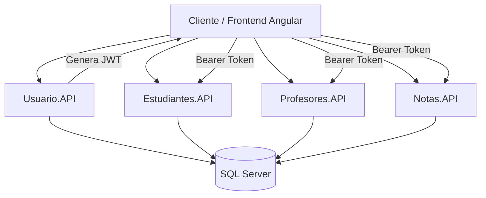
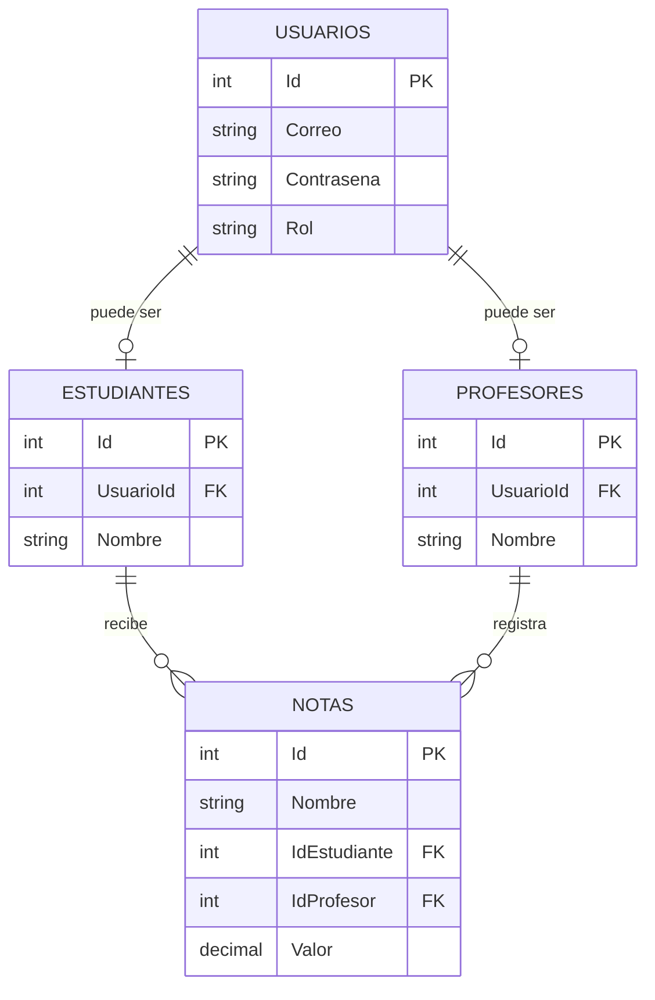

# Sistema de Gestión de Notas – Backend

## Descripción
Este proyecto implementa una solución backend basada en una arquitectura de microservicios para la gestión de estudiantes, profesores y notas académicas.

La solución está compuesta por cuatro microservicios:

- Usuario.API
- Estudiantes.API
- Profesores.API
- Notas.API

Los microservicios están desarrollados con ASP.NET Core sobre .NET 8 y utilizan Entity Framework Core para el acceso a datos y SQL Server como motor de base de datos.

El sistema implementa autenticación mediante JWT, autorización basada en roles, validaciones, manejo global de excepciones, logging con Serilog, paginación de resultados y documentación de los endpoints mediante Swagger.

Los microservicios comparten una misma base de datos SQL Server debido a los requerimientos de integridad referencial entre las entidades del sistema.


## Tecnologías utilizadas
- .NET 8 – Framework principal para el desarrollo de los microservicios.
- ASP.NET Core Web API – Desarrollo de las APIs REST.
- Entity Framework Core – ORM utilizado para el acceso y gestión de datos.
- SQL Server – Motor de base de datos relacional.
- JWT (JSON Web Token) – Autenticación y autorización de usuarios.
- Serilog – Sistema de logging para el registro de eventos y errores.
- Swagger / OpenAPI – Documentación y pruebas de los endpoints REST.
- Clean Architecture – Organización y separación de responsabilidades dentro de los microservicios.
- Migrations de Entity Framework Core – Creación y actualización del esquema de base de datos.
- Visual Studio / Visual Studio Code – Entornos utilizados para el desarrollo.
- Mermaid – Creación de diagramas de arquitectura y flujo dentro de la documentación.
- Git – Control de versiones.


## Arquitectura del sistema
## Arquitectura del sistema

El backend está compuesto por cuatro microservicios independientes, cada uno encargado de una responsabilidad específica dentro del sistema.


Microservicios
- Usuario.API: Gestiona los usuarios del sistema, autenticación y registro de estudiantes y profesores.
- Estudiantes.API: Gestiona la información de los estudiantes.
- Profesores.API: Gestiona la información de los profesores.
- Notas.API: Gestiona las notas académicas asociadas a estudiantes y profesores.
  
Comunicación

El frontend se comunica directamente con cada microservicio mediante solicitudes HTTP/HTTPS. No se utiliza un API Gateway.
La autenticación se realiza mediante JWT. Después de iniciar sesión mediante Usuario.API, el frontend recibe un token que posteriormente envía en el encabezado Authorization de las solicitudes a los demás microservicios.
Los cuatro microservicios utilizan una misma instancia de SQL Server para mantener la integridad referencial entre las entidades relacionadas.

## Estructura de la solución

La solución está organizada en cuatro microservicios independientes. Cada microservicio sigue una estructura basada en Clean Architecture, separando responsabilidades entre dominio, aplicación, infraestructura y API.

```text
SistemaGestionNotas/
│
├── Usuario/
│   ├── Usuario.API/
│   ├── Usuario.Application/
│   ├── Usuario.Domain/
│   └── Usuario.Infrastructure/
│
├── Estudiantes/
│   ├── Estudiantes.API/
│   ├── Estudiantes.Application/
│   ├── Estudiantes.Domain/
│   └── Estudiantes.Infrastructure/
│
├── Profesores/
│   ├── Profesores.API/
│   ├── Profesores.Application/
│   ├── Profesores.Domain/
│   └── Profesores.Infrastructure/
│
├── Notas/
│   ├── Notas.API/
│   ├── Notas.Application/
│   ├── Notas.Domain/
│   └── Notas.Infrastructure/
│
└── SistemaGestionNotas.sln
```
Capas
Cada microservicio se divide en las siguientes capas:
- API: Contiene los controladores, configuración de la aplicación, middleware y exposición de los endpoints HTTP.
- Application: Contiene la lógica de aplicación, DTOs, interfaces y servicios necesarios para ejecutar los casos de uso.
- Domain: Contiene las entidades y reglas propias del dominio del microservicio.
- Infrastructure: Contiene la implementación del acceso a datos mediante Entity Framework Core, configuración de la base de datos y demás servicios externos.
Esta separación permite mantener las responsabilidades desacopladas y facilita el mantenimiento, las pruebas y la evolución independiente de cada microservicio.

## Base de datos

El sistema utiliza **SQL Server** como motor de base de datos.

Los cuatro microservicios utilizan la misma base de datos debido a las relaciones entre las entidades y a la necesidad de mantener la integridad referencial mediante claves foráneas.

La base de datos contiene principalmente las siguientes entidades:

- **Usuarios:** Información de autenticación y rol de los usuarios.
- **Estudiantes:** Información asociada a los usuarios registrados como estudiantes.
- **Profesores:** Información asociada a los usuarios registrados como profesores.
- **Notas:** Calificaciones asociadas a un estudiante y al profesor que las registra.

### Relaciones principales


### Configuración de la conexión

La cadena de conexión a SQL Server se encuentra configurada en el archivo `appsettings.json` de cada microservicio.

Ejemplo:

```json
"ConnectionStrings": {
  "DefaultConnection": "Server=localhost;Database=SistemaGestionNotas;Trusted_Connection=True;TrustServerCertificate=True;"
}
```

> La cadena de conexión debe ajustarse de acuerdo con la configuración de SQL Server utilizada en el entorno local.

### Creación de la base de datos mediante Entity Framework Core

El esquema de la base de datos se administra mediante **migraciones de Entity Framework Core**.

Para crear o actualizar la base de datos, se debe seleccionar como proyecto de inicio el proyecto `*.API` correspondiente y ejecutar las migraciones desde la **Package Manager Console** de Visual Studio.

Ejemplo:

```powershell
Update-Database
```

### Creación de migraciones

Si es necesario generar una nueva migración después de modificar las entidades:
```powershell
Add-Migration NombreDeLaMigracion
```
Posteriormente:
```powershell
Update-Database
```
Esto permite mantener sincronizado el modelo de entidades con el esquema de SQL Server.

## Autenticación y autorización

El sistema utiliza **JWT (JSON Web Token)** para autenticar a los usuarios y controlar el acceso a los diferentes endpoints de los microservicios.

El proceso de autenticación funciona de la siguiente manera:

1. El usuario envía su correo y contraseña al endpoint de autenticación de `Usuario.API`.
2. Si las credenciales son válidas, el servicio genera un JWT.
3. El token contiene la información necesaria para identificar al usuario y su rol.
4. El cliente debe enviar el token en las solicitudes a los endpoints protegidos mediante el encabezado:

```http
Authorization: Bearer {token}
```

### Roles

El sistema maneja tres roles:

- **Admin**
- **Profesor**
- **Estudiante**

La autorización se realiza mediante los roles asociados al usuario autenticado.

### Permisos por rol

| Recurso | Admin | Profesor | Estudiante |
|----------|:-----:|:--------:|:----------:|
| Consultar estudiantes | ✅ | ✅ | ❌ |
| Crear estudiantes | ✅ | ❌ | ❌ |
| Editar estudiantes | ✅ | ❌ | ❌ |
| Eliminar estudiantes | ✅ | ❌ | ❌ |
| Consultar profesores | ✅ | ✅ | ❌ |
| Crear profesores | ✅ | ❌ | ❌ |
| Editar profesores | ✅ | ❌ | ❌ |
| Eliminar profesores | ✅ | ❌ | ❌ |
| Consultar todas las notas | ✅ | ✅ | ❌ |
| Crear notas |  ❌ | ✅ | ❌ |
| Editar notas | ✅ | ✅ | ❌ |
| Eliminar notas | ✅ | ✅ | ❌ |
| Consultar sus propias notas | ❌ | ❌ | ✅ |

### Seguridad

La autorización del backend es la encargada de garantizar la seguridad de los recursos.

Aunque el frontend también restringe la navegación y las opciones disponibles según el rol del usuario, estas restricciones son únicamente de presentación y experiencia de usuario. La validación definitiva de permisos se realiza en los microservicios mediante la autenticación y autorización configuradas en la API.

## Microservicios

El backend está compuesto por cuatro microservicios independientes. Cada uno se encarga de una responsabilidad específica dentro del sistema y expone sus propios endpoints REST.

### Usuario.API

Microservicio encargado de la gestión de usuarios y del proceso de autenticación del sistema.

Sus principales responsabilidades son:

- Registro de usuarios.
- Autenticación mediante correo y contraseña.
- Generación de tokens JWT.
- Gestión de roles de usuario.
- Registro de estudiantes y profesores.

**URL base:**

```text
https://localhost:7223
```

**Endpoint principal de autenticación:**
```text
POST /api/Usuario/login
```


### Estudiantes.API

Microservicio encargado de administrar la información de los estudiantes registrados en el sistema.

Permite realizar operaciones de consulta, creación, actualización y eliminación de estudiantes de acuerdo con los permisos del usuario autenticado.

Sus principales responsabilidades son:

- Consultar estudiantes.
- Consultar un estudiante por su identificador.
- Crear estudiantes.
- Actualizar información de estudiantes.
- Eliminar estudiantes.
- Obtener el identificador del estudiante asociado al usuario autenticado.

**URL base:**

```text
https://localhost:7061
```

### Profesores.API

Microservicio encargado de administrar la información de los profesores registrados en el sistema.

Permite realizar operaciones de consulta, creación, actualización y eliminación de profesores de acuerdo con los permisos del usuario autenticado.

Sus principales responsabilidades son:

- Consultar profesores.
- Consultar un profesor por su identificador.
- Crear profesores.
- Actualizar información de profesores.
- Eliminar profesores.

**URL base:**

```text
https://localhost:7116
```

### Notas.API

Microservicio encargado de administrar las notas académicas registradas en el sistema.

Permite realizar operaciones de consulta, creación, actualización y eliminación de notas de acuerdo con los permisos del usuario autenticado.

Sus principales responsabilidades son:

- Consultar todas las notas.
- Consultar una nota por su identificador.
- Crear notas.
- Actualizar notas.
- Eliminar notas.
- Consultar las notas correspondientes al estudiante autenticado.

**URL base:**

```text
https://localhost:7290
```

## Manejo de errores

El backend cuenta con un mecanismo global para el manejo de excepciones mediante un **middleware de manejo de errores**.

Este middleware permite centralizar el tratamiento de las excepciones generadas durante el procesamiento de las solicitudes, evitando duplicar lógica de manejo de errores en cada controlador.

Entre sus principales responsabilidades se encuentran:

- Capturar excepciones no controladas.
- Registrar los errores generados durante la ejecución.
- Retornar respuestas HTTP apropiadas al cliente.
- Evitar exponer información interna o sensible de la aplicación.
- Mantener una estructura uniforme en las respuestas de error.

### Respuestas de error

Dependiendo del tipo de error, las APIs retornan el código de estado HTTP correspondiente.

Algunos de los códigos utilizados son:

| Código | Descripción |
|--------|-------------|
| `200 OK` | Solicitud procesada correctamente. |
| `201 Created` | Recurso creado correctamente. |
| `400 Bad Request` | La solicitud contiene datos inválidos. |
| `401 Unauthorized` | El usuario no está autenticado o el token no es válido. |
| `403 Forbidden` | El usuario está autenticado, pero no tiene permisos para realizar la operación. |
| `404 Not Found` | El recurso solicitado no existe. |
| `500 Internal Server Error` | Se produjo un error inesperado en el servidor. |

### Manejo centralizado

El middleware se ejecuta de forma global dentro de cada microservicio, permitiendo que los errores sean tratados de manera consistente independientemente del controlador o endpoint donde se produzcan.

Esto facilita el mantenimiento del código y proporciona una respuesta uniforme al frontend ante situaciones inesperadas.


## Logging

El backend utiliza **Serilog** para registrar eventos, información de ejecución y errores generados durante el funcionamiento de los microservicios.

Cada microservicio cuenta con su propia configuración de logging, permitiendo realizar seguimiento de las operaciones y facilitar la identificación de problemas durante el desarrollo y ejecución de la aplicación.

### Características

- Registro de información de ejecución.
- Registro de errores y excepciones.
- Registro de eventos relevantes de los microservicios.
- Generación de archivos de log.
- Creación de archivos de log diarios.
- Facilita el diagnóstico y seguimiento de errores.

### Archivos de log

Los registros se almacenan en archivos separados por día, permitiendo consultar los eventos generados en una fecha específica sin mezclar los registros de diferentes días.

La información registrada puede utilizarse para realizar seguimiento de las solicitudes procesadas y detectar posibles errores durante la ejecución de los servicios.

### Serilog

La configuración de **Serilog** se realiza durante el inicio de cada microservicio y permite definir los destinos y niveles de información que serán registrados.

El logging complementa el middleware global de manejo de errores, permitiendo que las excepciones capturadas sean registradas para facilitar su posterior análisis.


## Swagger / OpenAPI

El backend utiliza **Swagger / OpenAPI** para documentar, visualizar y probar los endpoints disponibles en cada uno de los microservicios.

Swagger permite consultar de forma interactiva los recursos expuestos por las APIs sin necesidad de utilizar herramientas externas para realizar las solicitudes HTTP.

### Características

- Documentación automática de los endpoints.
- Visualización de métodos HTTP disponibles.
- Consulta de parámetros y modelos de solicitud.
- Visualización de las respuestas de cada endpoint.
- Pruebas de los endpoints directamente desde el navegador.
- Soporte para autenticación mediante **JWT Bearer Token**.

### Acceso

Cada microservicio dispone de su propia interfaz de Swagger:

```text
Usuario.API
https://localhost:7223/swagger

Estudiantes.API
https://localhost:7061/swagger

Profesores.API
https://localhost:7116/swagger

Notas.API
https://localhost:7290/swagger
```

### Autenticación mediante JWT

Los endpoints protegidos requieren un token JWT válido.

Una vez obtenido el token mediante el endpoint de login de `Usuario.API`, este puede utilizarse en Swagger mediante la opción **Authorize**.

El token debe enviarse utilizando el esquema:

```text
Bearer {token}
```
De esta manera es posible probar desde Swagger tanto los endpoints públicos como aquellos que requieren autenticación y autorización según el rol del usuario.

## Cómo ejecutar el proyecto

### Requisitos previos
### Configuración de SQL Server
### Configuración de conexión
### Ejecutar migraciones
### Proyectos de inicio
### Ejecución de los microservicios

## Flujo de autenticación

## Diagramas

## Consideraciones
